# Stock Database ER Diagram

```mermaid
erDiagram
    %% ============================================================
    %% Table: stock_basic - 股票基本資料
    %% ============================================================
    stock_basic {
        string stock_code PK
        string name
        string market
        string industry
        date listed_date
        timestamp created_at
        timestamp updated_at
    }

    %% ============================================================
    %% Table: sectors - 產業分類
    %% ============================================================
    sectors {
        string sector_code PK
        string sector_name
        string parent_code FK
        integer level
        timestamp created_at
        timestamp updated_at
    }

    %% ============================================================
    %% Table: daily_kline - 日 K 線資料
    %% ============================================================
    daily_kline {
        integer id PK
        string stock_code FK
        date trade_date
        numeric open_price
        numeric high_price
        numeric low_price
        numeric close_price
        bigint volume
        numeric amount
        numeric change
        timestamp created_at
    }

    %% ============================================================
    %% Table: sector_kline - 產業 K 線資料
    %% ============================================================
    sector_kline {
        integer id PK
        string sector_code FK
        date trade_date
        numeric open_price
        numeric high_price
        numeric low_price
        numeric close_price
        bigint volume
        numeric amount
        timestamp created_at
    }

    %% ============================================================
    %% Table: institutional_investors - 法人買賣資料
    %% ============================================================
    institutional_investors {
        integer id PK
        string stock_code FK
        date trade_date
        numeric foreign_buy
        numeric foreign_sell
        numeric foreign_net
        numeric trust_buy
        numeric trust_sell
        numeric trust_net
        numeric dealer_buy
        numeric dealer_sell
        numeric dealer_net
        timestamp created_at
    }

    %% ============================================================
    %% Table: monthly_revenue - 月營收 (上市)
    %% ============================================================
    monthly_revenue {
        integer id PK
        string stock_code FK
        string year_month
        numeric revenue
        numeric month_over_month
        numeric year_over_year
        timestamp created_at
    }

    %% ============================================================
    %% Table: monthly_revenue_tpex - 月營收 (上櫃)
    %% ============================================================
    monthly_revenue_tpex {
        integer id PK
        string stock_code FK
        string year_month
        numeric revenue
        numeric month_over_month
        numeric year_over_year
        timestamp created_at
    }

    %% ============================================================
    %% Table: quarterly_profit - 季獲利資料
    %% ============================================================
    quarterly_profit {
        integer id PK
        string stock_code FK
        string quarter
        numeric revenue
        numeric gross_profit
        numeric operating_profit
        numeric net_profit
        numeric eps
        timestamp created_at
    }

    %% ============================================================
    %% Table: fetch_history - 資料擷取歷史
    %% ============================================================
    fetch_history {
        integer id PK
        string table_name
        string stock_code
        date start_date
        date end_date
        integer record_count
        string status
        text error_message
        timestamp created_at
    }

    %% ============================================================
    %% Relationships
    %% ============================================================

    %% stock_basic relationships
    stock_basic ||--o{ daily_kline : "stock_code"
    stock_basic ||--o{ institutional_investors : "stock_code"
    stock_basic ||--o{ monthly_revenue : "stock_code"
    stock_basic ||--o{ monthly_revenue_tpex : "stock_code"
    stock_basic ||--o{ quarterly_profit : "stock_code"

    %% sectors self-referencing relationship
    sectors ||--o| sectors : "parent_code"

    %% sectors to sector_kline relationship
    sectors ||--o{ sector_kline : "sector_code"

    %% fetch_history references multiple tables (no FK constraint)
    stock_basic ||--o{ fetch_history : "stock_code"
    sectors ||--o{ fetch_history : "sector_code"
```

## 資料表關係說明

### 主表 (Master Tables)
- **stock_basic**: 股票基本資料，是 most other tables 的核心參照
- **sectors**: 產業分類，支援 self-referencing (parent_code) 實現階層式產業結構

### 資料表 (Data Tables)
| Table | 描述 | 關聯主表 |
|-------|-----|---------|
| daily_kline | 日 K 線資料 | stock_basic (stock_code) |
| sector_kline | 產業 K 線資料 | sectors (sector_code) |
| institutional_investors | 法人買賣資料 | stock_basic (stock_code) |
| monthly_revenue | 月營收 (上市) | stock_basic (stock_code) |
| monthly_revenue_tpex | 月營收 (上櫃) | stock_basic (stock_code) |
| quarterly_profit | 季獲利資料 | stock_basic (stock_code) |
| fetch_history | 資料擷取歷史 | 可關聯 stock_basic 或 sectors |

### 特殊設計
- **sectors.parent_code**: 自關聯欄位，實現產業樹狀結構 (如: 半導體 -> IC設計)
- **fetch_history**: 記錄資料擷取歷程，可追蹤各表的最後更新時間與狀態
- **Unique Constraints**: 所有 data tables 都有 unique(stock_code, date) 防止重複資料

Generated: 2026-04-13
