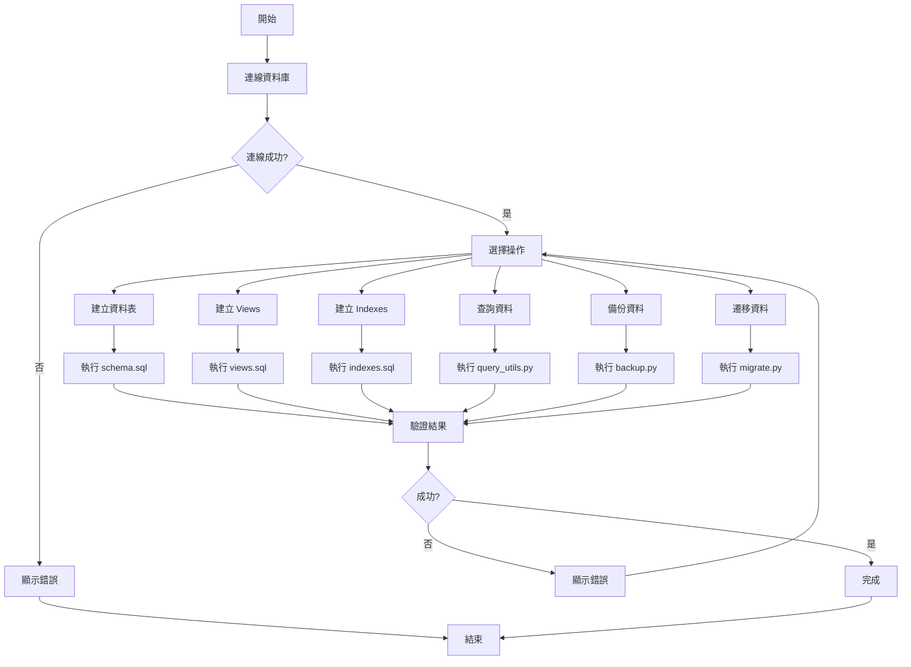
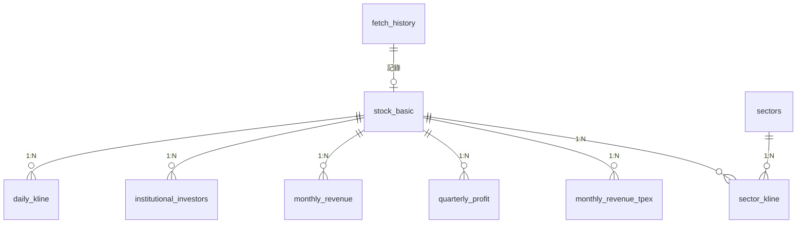
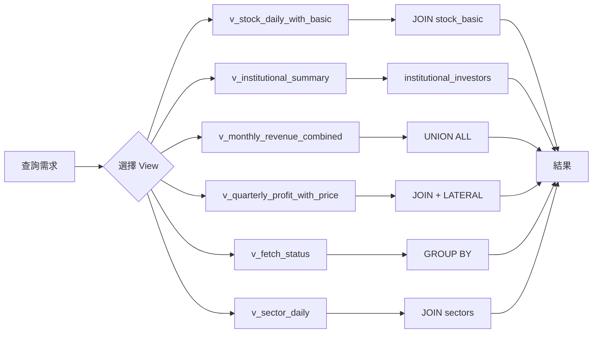
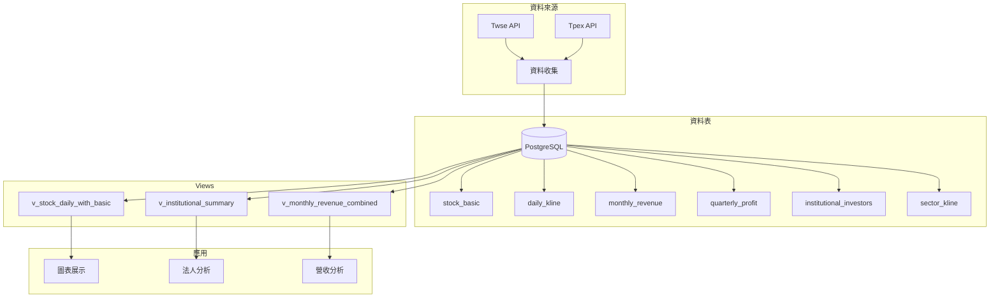

# ProTech-QuantStockDB 流程圖

## 資料庫操作流程

```mermaid
flowchart TD
    A[開始] --> B[連線資料庫]
    B --> C{連線成功?}
    C -->|否| D[顯示錯誤]
    D --> E[結束]
    C -->|是| F[選擇操作]
    
    F --> G[建立資料表]
    F --> H[建立 Views]
    F --> I[建立 Indexes]
    F --> J[查詢資料]
    F --> K[備份資料]
    F --> L[遷移資料]
    
    G --> G1[執行 schema.sql]
    H --> H1[執行 views.sql]
    I --> I1[執行 indexes.sql]
    J --> J1[執行 query_utils.py]
    K --> K1[執行 backup.py]
    L --> L1[執行 migrate.py]
    
    G1 --> M[驗證結果]
    H1 --> M
    I1 --> M
    J1 --> M
    K1 --> M
    L1 --> M
    
    M --> N{成功?}
    N -->|否| O[顯示錯誤]
    O --> F
    N -->|是| P[完成]
    P --> E
```

## 資料表關聯

```mermaid
erDiagram
    stock_basic ||--o{ daily_kline : "1:N"
    stock_basic ||--o{ institutional_investors : "1:N"
    stock_basic ||--o{ monthly_revenue : "1:N"
    stock_basic ||--o{ quarterly_profit : "1:N"
    stock_basic ||--o{ monthly_revenue_tpex : "1:N"
    sectors ||--o{ sector_kline : "1:N"
    stock_basic ||--o{ sector_kline : "1:N"
    fetch_history ||--o| stock_basic : "記錄"
```

## Views 使用流程

```mermaid
flowchart LR
    A[查詢需求] --> B{選擇 View}
    
    B --> C[v_stock_daily_with_basic]
    B --> D[v_institutional_summary]
    B --> E[v_monthly_revenue_combined]
    B --> F[v_quarterly_profit_with_price]
    B --> G[v_fetch_status]
    B --> H[v_sector_daily]
    
    C --> I[JOIN stock_basic]
    D --> J[institutional_investors]
    E --> K[UNION ALL]
    F --> L[JOIN + LATERAL]
    G --> M[GROUP BY]
    H --> N[JOIN sectors]
    
    I --> O[結果]
    J --> O
    K --> O
    L --> O
    M --> O
    N --> O
```

## 資料流動

```mermaid
flowchart TB
    subgraph 資料來源
        T[Twse API] --> R[資料收集]
        TP[Tpex API] --> R
    end
    
    R --> DB[(PostgreSQL)]
    
    subgraph 資料表
        DB --> TB1[stock_basic]
        DB --> TB2[daily_kline]
        DB --> TB3[monthly_revenue]
        DB --> TB4[quarterly_profit]
        DB --> TB5[institutional_investors]
        DB --> TB6[sector_kline]
    end
    
    subgraph Views
        DB --> V1[v_stock_daily_with_basic]
        DB --> V2[v_institutional_summary]
        DB --> V3[v_monthly_revenue_combined]
    end
    
    subgraph 應用
        V1 --> A1[圖表展示]
        V2 --> A2[法人分析]
        V3 --> A3[營收分析]
    end
```
